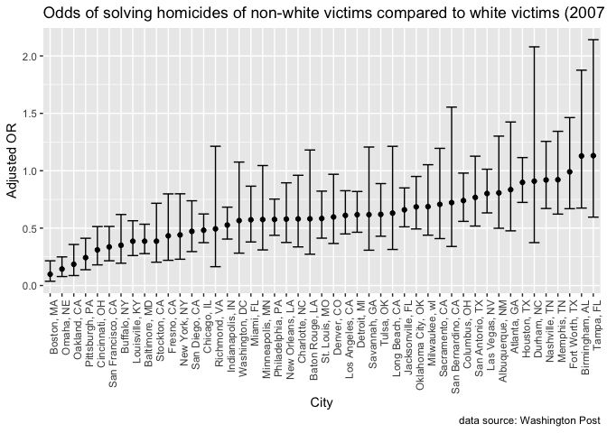

p8105 Homework 6
================
Tory Lynch
November 26, 2018

#### Problem 1

``` r
#Load and clean data 
homicide_data = read_csv("data/homicide-data.csv", na = c("", "NA", "Unknown")) %>% 
  mutate(
    city_state = str_c(city, state, sep = ", "), 
    resolution = case_when(
      disposition == "Closed without arrest" ~ "unsolved", 
      disposition == "Open/No arrest" ~ "unsolved", 
      disposition == "Closed by arrest" ~ "solved"
    )
  ) %>% 
  filter(!city_state %in% c("Dallas, TX", "Phoenix, AZ", "Kansas City, MO", "Tulsa, AL")) %>% 
  mutate(
    race = as.factor(case_when(
      victim_race == "White" ~ "white", 
      victim_race != "White" ~ "non-white"
    ))
  ) %>% 
  mutate(age = as.numeric(victim_age)) %>% 
  mutate(race = fct_relevel(race, "white")) %>% 
  mutate(sex = fct_relevel(victim_sex, "Female")) %>% 
  mutate(resolution = fct_relevel(resolution, "unsolved"))
```

##### Logistic model for Baltimore, MD

``` r
logistic_model = homicide_data %>% 
  filter(city_state == "Baltimore, MD") %>% 
  glm(resolution ~ age + sex + race, data = ., family = binomial())

logistic_model %>% 
  broom::tidy(., conf.int = TRUE) %>% 
  mutate(
    OR = exp(estimate), 
    ci.high = exp(conf.high),
    ci.low = exp(conf.low)
  ) %>% 
  dplyr::select(term, OR, ci.high, ci.low) %>% 
 knitr:: kable(digits = 4)
```

| term          |      OR|  ci.high|  ci.low|
|:--------------|-------:|--------:|-------:|
| (Intercept)   |  3.2741|   5.2122|  2.0760|
| age           |  0.9930|   0.9994|  0.9867|
| sexMale       |  0.4116|   0.5369|  0.3148|
| racenon-white |  0.4406|   0.6197|  0.3122|

##### Logistic model for all cities

``` r
 homicide_data %>% 
  group_by(city_state) %>% 
  nest() %>% 
  mutate(model = map(data, ~glm(resolution ~ race + age + sex, data = ., family = binomial())),
         model = map(model, broom::tidy, conf.int = TRUE)) %>% 
  dplyr::select(-data) %>%    
  unnest() %>% 
  mutate(
    OR = exp(estimate), 
    ci.high = exp(conf.high),
    ci.low = exp(conf.low)
  ) %>% 
  filter(term == "racenon-white") %>% 
  dplyr::select(city_state, term, OR, ci.high, ci.low) %>% 
 knitr:: kable(digits = 4)
```

| city\_state        | term          |      OR|  ci.high|  ci.low|
|:-------------------|:--------------|-------:|--------:|-------:|
| Albuquerque, NM    | racenon-white |  0.7392|   1.2202|  0.4449|
| Atlanta, GA        | racenon-white |  0.7528|   1.2991|  0.4244|
| Baltimore, MD      | racenon-white |  0.4406|   0.6197|  0.3122|
| Baton Rouge, LA    | racenon-white |  0.6676|   1.4053|  0.3044|
| Birmingham, AL     | racenon-white |  1.0393|   1.7537|  0.6117|
| Boston, MA         | racenon-white |  0.1267|   0.2854|  0.0472|
| Buffalo, NY        | racenon-white |  0.3923|   0.7144|  0.2113|
| Charlotte, NC      | racenon-white |  0.5575|   0.9507|  0.3131|
| Chicago, IL        | racenon-white |  0.5621|   0.7343|  0.4318|
| Cincinnati, OH     | racenon-white |  0.3184|   0.5413|  0.1799|
| Columbus, OH       | racenon-white |  0.8607|   1.1612|  0.6382|
| Denver, CO         | racenon-white |  0.6019|   1.0077|  0.3576|
| Detroit, MI        | racenon-white |  0.6516|   0.8699|  0.4877|
| Durham, NC         | racenon-white |  1.0028|   2.4519|  0.3903|
| Fort Worth, TX     | racenon-white |  0.8378|   1.2636|  0.5528|
| Fresno, CA         | racenon-white |  0.4449|   0.8411|  0.2208|
| Houston, TX        | racenon-white |  0.8726|   1.0897|  0.6984|
| Indianapolis, IN   | racenon-white |  0.5046|   0.6653|  0.3808|
| Jacksonville, FL   | racenon-white |  0.6582|   0.8618|  0.5018|
| Las Vegas, NV      | racenon-white |  0.7627|   0.9813|  0.5914|
| Long Beach, CA     | racenon-white |  0.7939|   1.6055|  0.3790|
| Los Angeles, CA    | racenon-white |  0.6658|   0.9160|  0.4812|
| Louisville, KY     | racenon-white |  0.3919|   0.5899|  0.2572|
| Memphis, TN        | racenon-white |  0.7782|   1.1542|  0.5163|
| Miami, FL          | racenon-white |  0.5767|   0.8854|  0.3758|
| Milwaukee, wI      | racenon-white |  0.6324|   0.9816|  0.3983|
| Minneapolis, MN    | racenon-white |  0.6457|   1.2040|  0.3409|
| Nashville, TN      | racenon-white |  0.9023|   1.2391|  0.6546|
| New Orleans, LA    | racenon-white |  0.4668|   0.7385|  0.2947|
| New York, NY       | racenon-white |  0.5318|   0.9890|  0.2707|
| Oakland, CA        | racenon-white |  0.2130|   0.4182|  0.0989|
| Oklahoma City, OK  | racenon-white |  0.6813|   0.9697|  0.4771|
| Omaha, NE          | racenon-white |  0.1701|   0.3000|  0.0914|
| Philadelphia, PA   | racenon-white |  0.6438|   0.8500|  0.4845|
| Pittsburgh, PA     | racenon-white |  0.2816|   0.4852|  0.1573|
| Richmond, VA       | racenon-white |  0.4474|   1.1501|  0.1442|
| San Antonio, TX    | racenon-white |  0.6893|   1.0256|  0.4586|
| Sacramento, CA     | racenon-white |  0.7807|   1.3476|  0.4432|
| Savannah, GA       | racenon-white |  0.6050|   1.2767|  0.2789|
| San Bernardino, CA | racenon-white |  0.8801|   1.9992|  0.3937|
| San Diego, CA      | racenon-white |  0.4834|   0.7783|  0.2944|
| San Francisco, CA  | racenon-white |  0.4583|   0.7189|  0.2880|
| St. Louis, MO      | racenon-white |  0.5770|   0.8186|  0.4046|
| Stockton, CA       | racenon-white |  0.3757|   0.7127|  0.1933|
| Tampa, FL          | racenon-white |  1.1588|   2.2929|  0.5849|
| Tulsa, OK          | racenon-white |  0.5955|   0.8660|  0.4063|
| Washington, DC     | racenon-white |  0.5139|   0.9968|  0.2516|

``` r
 nested_homicide_data = homicide_data %>% 
  group_by(city_state) %>% 
  nest() %>% 
  mutate(model = map(data, ~glm(resolution ~ race, data = ., family = binomial())),
         model = map(model, broom::tidy, conf.int = TRUE)) %>% 
  dplyr::select(-data) %>%    
  unnest() %>% 
  mutate(
    OR = exp(estimate), 
    ci.high = exp(conf.high),
    ci.low = exp(conf.low)
  ) %>% 
  filter(term == "racenon-white") %>% 
  dplyr::select(city_state, term, OR, ci.high, ci.low) 

nested_homicide_data %>% 
  knitr::kable(digitis = 3)
```

| city\_state        | term          |         OR|    ci.high|     ci.low|
|:-------------------|:--------------|----------:|----------:|----------:|
| Albuquerque, NM    | racenon-white |  0.8070175|  1.3015908|  0.4989041|
| Atlanta, GA        | racenon-white |  0.8352273|  1.4246587|  0.4764263|
| Baltimore, MD      | racenon-white |  0.3861964|  0.5342392|  0.2778820|
| Baton Rouge, LA    | racenon-white |  0.5812854|  1.1805813|  0.2728276|
| Birmingham, AL     | racenon-white |  1.1283906|  1.8762403|  0.6748583|
| Boston, MA         | racenon-white |  0.0982334|  0.2153715|  0.0372487|
| Buffalo, NY        | racenon-white |  0.3505564|  0.6187820|  0.1943990|
| Charlotte, NC      | racenon-white |  0.5805243|  0.9604691|  0.3364271|
| Chicago, IL        | racenon-white |  0.4817128|  0.6233755|  0.3734182|
| Cincinnati, OH     | racenon-white |  0.3104301|  0.5137255|  0.1799137|
| Columbus, OH       | racenon-white |  0.7402720|  0.9794360|  0.5589668|
| Denver, CO         | racenon-white |  0.5972222|  0.9692002|  0.3662499|
| Detroit, MI        | racenon-white |  0.6169392|  0.8193405|  0.4640686|
| Durham, NC         | racenon-white |  0.9092072|  2.0793300|  0.3738183|
| Fort Worth, TX     | racenon-white |  0.9905009|  1.4631192|  0.6692273|
| Fresno, CA         | racenon-white |  0.4330065|  0.7983491|  0.2196639|
| Houston, TX        | racenon-white |  0.8986140|  1.1147546|  0.7241074|
| Indianapolis, IN   | racenon-white |  0.5268595|  0.6828473|  0.4046678|
| Jacksonville, FL   | racenon-white |  0.6598214|  0.8503358|  0.5112249|
| Las Vegas, NV      | racenon-white |  0.8016365|  1.0133340|  0.6329087|
| Long Beach, CA     | racenon-white |  0.6309859|  1.2127326|  0.3141567|
| Los Angeles, CA    | racenon-white |  0.6110700|  0.8258835|  0.4493081|
| Louisville, KY     | racenon-white |  0.3858730|  0.5644000|  0.2607753|
| Memphis, TN        | racenon-white |  0.9216809|  1.3435189|  0.6222317|
| Miami, FL          | racenon-white |  0.5728523|  0.8655122|  0.3795706|
| Milwaukee, wI      | racenon-white |  0.6872294|  1.0525228|  0.4386979|
| Minneapolis, MN    | racenon-white |  0.5752040|  1.0452830|  0.3102483|
| Nashville, TN      | racenon-white |  0.9195951|  1.2558739|  0.6710164|
| New Orleans, LA    | racenon-white |  0.5786402|  0.8948404|  0.3750708|
| New York, NY       | racenon-white |  0.4409036|  0.7990970|  0.2291013|
| Oakland, CA        | racenon-white |  0.1849257|  0.3578421|  0.0868095|
| Oklahoma City, OK  | racenon-white |  0.6853108|  0.9503091|  0.4928343|
| Omaha, NE          | racenon-white |  0.1438249|  0.2493421|  0.0783457|
| Philadelphia, PA   | racenon-white |  0.5760188|  0.7531209|  0.4373921|
| Pittsburgh, PA     | racenon-white |  0.2431143|  0.4117531|  0.1377103|
| Richmond, VA       | racenon-white |  0.4938272|  1.2132143|  0.1641375|
| San Antonio, TX    | racenon-white |  0.7675325|  1.1267783|  0.5181308|
| Sacramento, CA     | racenon-white |  0.7072464|  1.1951553|  0.4088180|
| Savannah, GA       | racenon-white |  0.6175439|  1.2065006|  0.3075643|
| San Bernardino, CA | racenon-white |  0.7222222|  1.5545501|  0.3402125|
| San Diego, CA      | racenon-white |  0.4718760|  0.7384378|  0.2956013|
| San Francisco, CA  | racenon-white |  0.3363754|  0.5147918|  0.2156581|
| St. Louis, MO      | racenon-white |  0.5841511|  0.8222528|  0.4127308|
| Stockton, CA       | racenon-white |  0.3862327|  0.7166210|  0.2033554|
| Tampa, FL          | racenon-white |  1.1310943|  2.1419081|  0.5958944|
| Tulsa, OK          | racenon-white |  0.6197746|  0.8880652|  0.4295053|
| Washington, DC     | racenon-white |  0.5657926|  1.0756636|  0.2821070|

``` r
nested_homicide_data %>% 
  mutate(city_state = fct_reorder(city_state, OR)) %>% 
  ggplot(aes(x = city_state, y = OR)) + 
  geom_point() + 
  geom_errorbar(aes(ymin = ci.low, ymax = ci.high)) + 
  theme(axis.text.x = element_text(angle = 90, hjust = 1)) + 
  labs(
    title = "Odds of solving homicides of non-white victims compared to white victims (2007 - 2015)",
    x = "City", 
    y = "Adjusted OR", 
    caption = "data source: Washington Post"
  )
```


